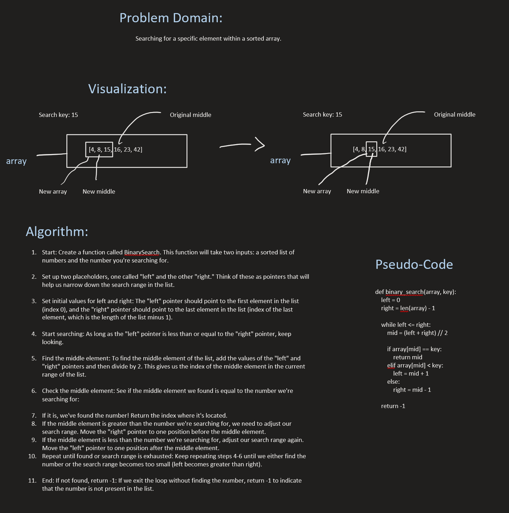

# Binary Search

## Whiteboard Process

## Approach & Efficiency
The Binary Search algorithm efficiently locates a target element within a sorted array by repeatedly dividing the search space in half. It compares the target element with the middle element of the array and adjusts the search space accordingly, reducing it logarithmically with each iteration. This approach ensures a time complexity of O(log n), making it highly efficient for large datasets.

## Solution
def binary_search(array, key):
    left = 0
    right = len(array) - 1

    while left <= right:
        mid = (left + right) // 2

        if array[mid] == key:
            return mid
        elif array[mid] < key:
            left = mid + 1
        else:
            right = mid - 1

    return -1
