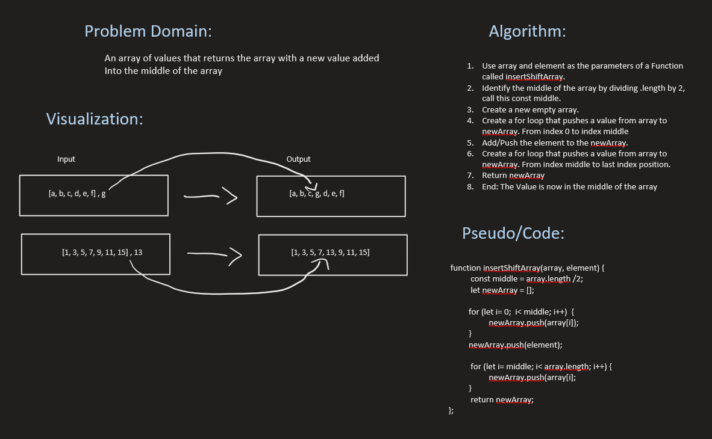

# Challenge Title
**array-insert-shift**

## Whiteboard Process

## Approach & Efficiency
I took the parameters and split them down the middle by dividing by 2 then added value in middle and put it back together in new Array.

## Solution
[See insertShift.js for code](./insertShift.js)
