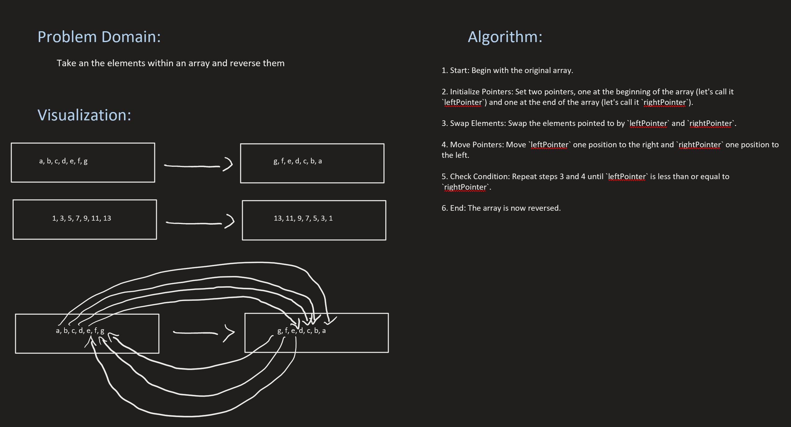
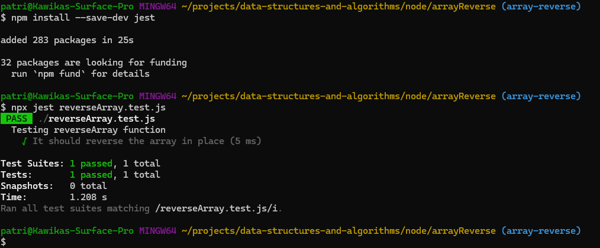

# Challenge Title
Write a function called reverseArray which takes an array as an argument. Without utilizing any of the built-in methods available to your language, return an array with elements in reversed order.

## Whiteboard Process

## Approach & Efficiency
1. **Approach**: The function reverses the array in place by swapping elements from the two ends until they meet in the middle.

2. **Efficiency**: The algorithm has a time complexity of O(n/2) since it only needs to iterate through half of the array to reverse it.

3. **Space Complexity**: The space complexity is O(1) because the algorithm operates directly on the input array without requiring additional space.

## Solution
**See [reverseArray.js](reverseArray.js) for code and [reverseArray.test.js](reverseArray.test.js) for test code**

**Follow these steps to run and test code**
- npm install --save-dev jest
- npx jest reverseArray.test.js

