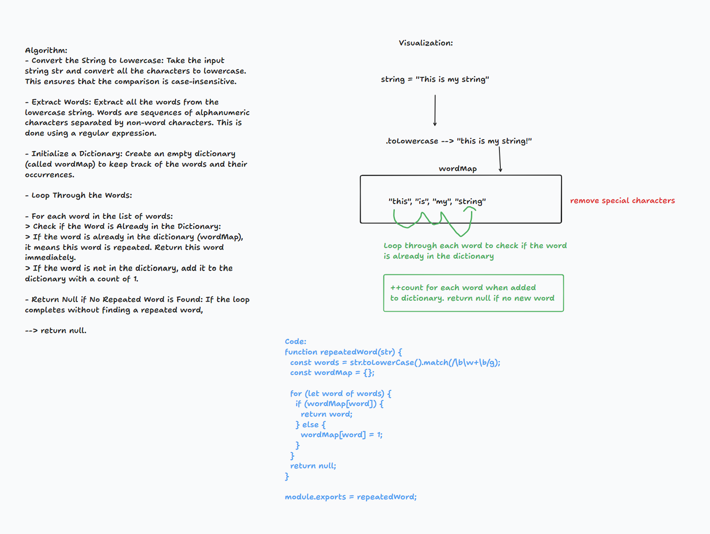

# Code-Challenge 31
Write a function called repeated word that finds the first word to occur more than once in a string

## Whiteboard Process


## Approach
1. **Convert String to Lowercase**:
   - Convert the input string to lowercase to ensure the comparison is case-insensitive.

2. **Extract Words**:
   - Use a regular expression to extract all words from the string. Words are sequences of alphanumeric characters.

3. **Initialize Dictionary**:
   - Create an empty dictionary to keep track of the words and their occurrences.

4. **Loop Through Words**:
   - For each word in the list of extracted words:
     - **Check Dictionary**: If the word is already in the dictionary, return this word as it is the first repeated word.
     - **Update Dictionary**: If the word is not in the dictionary, add it with a count of 1.

5. **Return Result**:
   - If the loop completes without finding a repeated word, return `null`.

## Efficiency:
- **Time Complexity**: O(n)
  - Converting the string to lowercase: O(n), where n is the length of the string.
  - Extracting words using a regular expression: O(n), assuming the regex engine processes each character once.
  - Looping through the words: O(m), where m is the number of words (which is ≤ n).
  - Dictionary operations (checking and updating): O(1) on average.

  Overall, the time complexity is O(n), where n is the length of the input string.

- **Space Complexity**: O(m)
  - The dictionary can potentially store up to m words, where m is the number of words in the input string.
  - Storing the words list also requires O(m) space.

## Solution:
The solution uses a dictionary to efficiently track the occurrence of each word. By leveraging the average O(1) time complexity of dictionary operations, the algorithm ensures that it processes each word in constant time. The approach ensures that the first repeated word is found as soon as possible without needing to examine the entire string multiple times. If no repeated word is found, the algorithm returns `null`. This method is both time-efficient and space-efficient for this problem.

### Code:
``` function repeatedWord(str) {
  const words = str.toLowerCase().match(/\b\w+\b/g);
  const wordMap = {};

  for (let word of words) {
    if (wordMap[word]) {
      return word;
    } else {
      wordMap[word] = 1;
    }
  }
  return null;
}

module.exports = repeatedWord;
