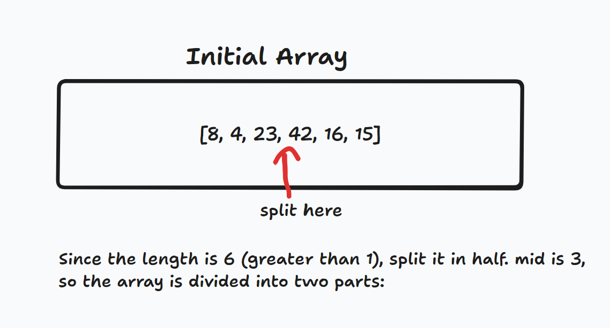
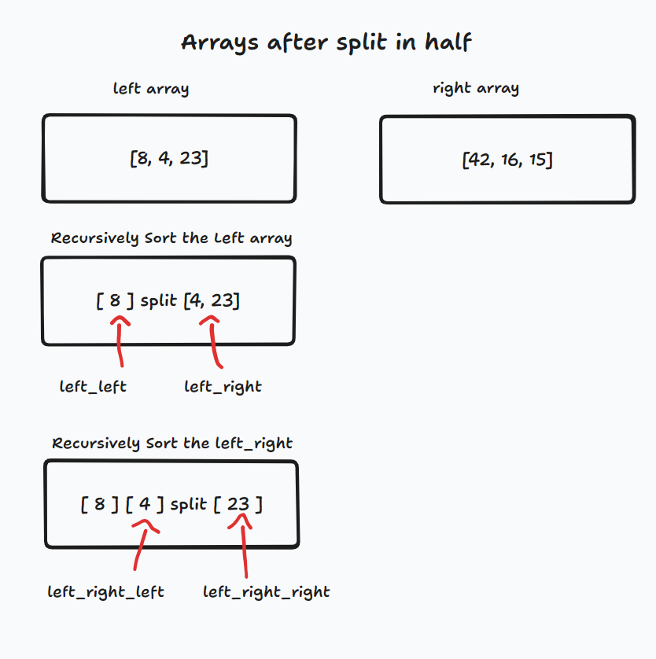
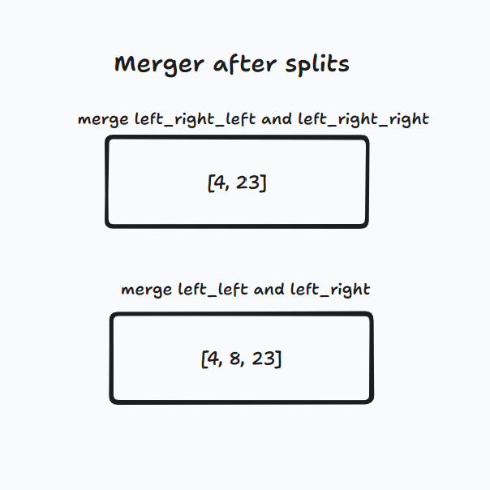
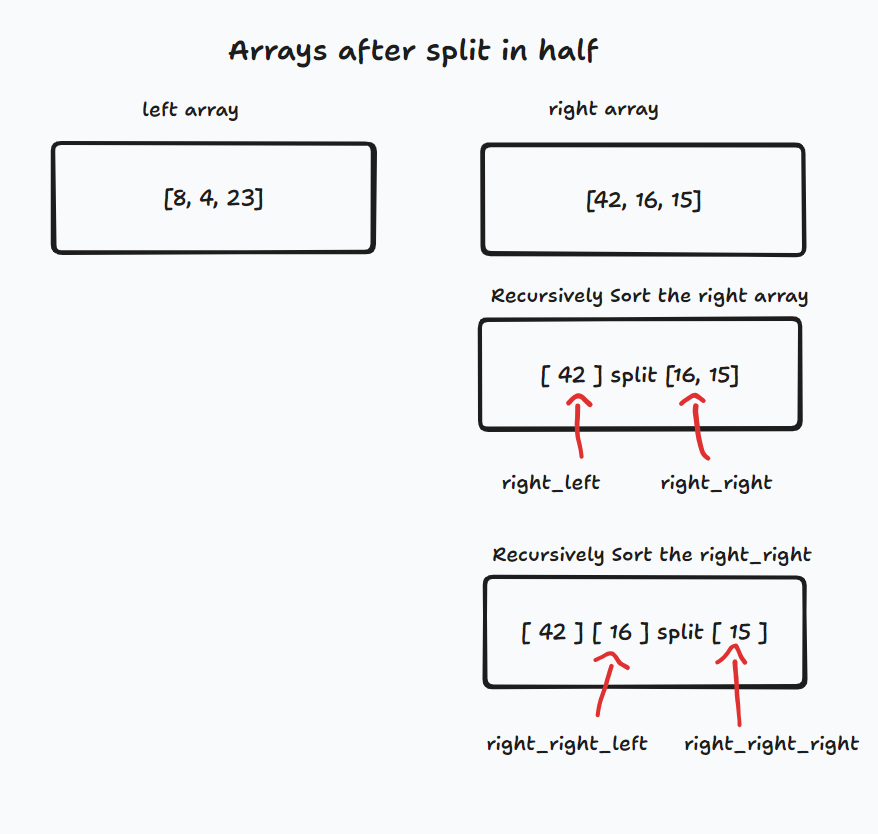
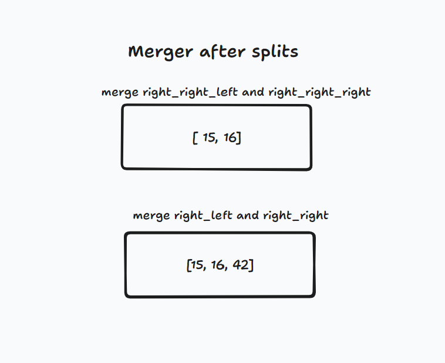
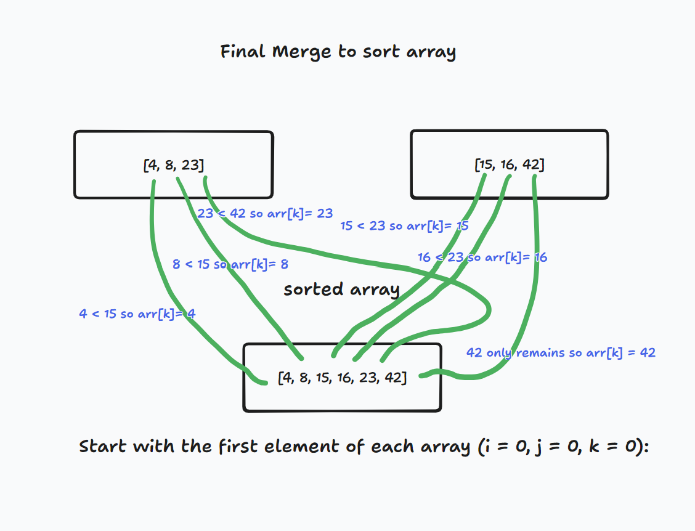
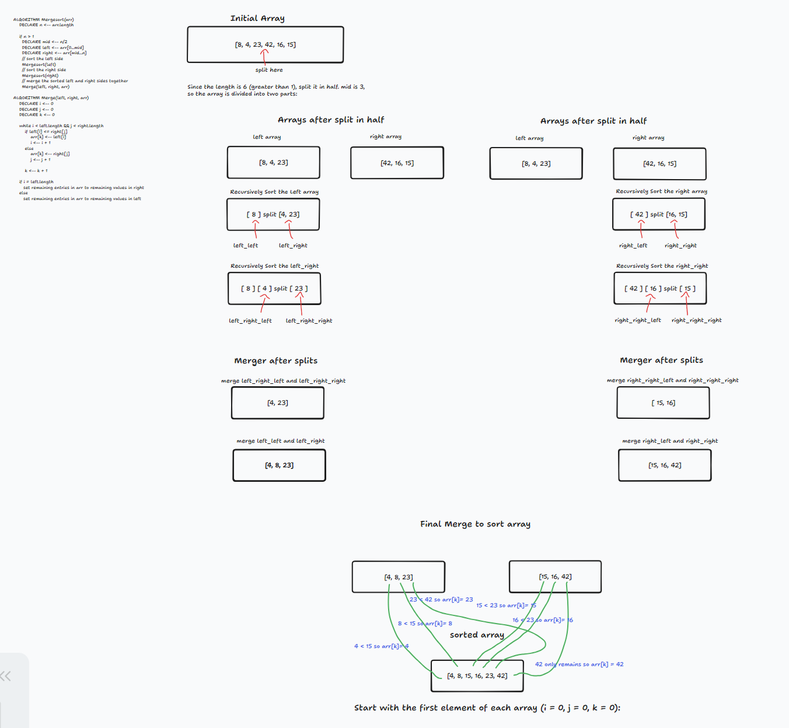

# Merge Sort

### Pseudo Code:
ALGORITHM Mergesort(arr)
    DECLARE n <-- arr.length

    if n > 1
      DECLARE mid <-- n/2
      DECLARE left <-- arr[0...mid]
      DECLARE right <-- arr[mid...n]
      // sort the left side
      Mergesort(left)
      // sort the right side
      Mergesort(right)
      // merge the sorted left and right sides together
      Merge(left, right, arr)

ALGORITHM Merge(left, right, arr)
    DECLARE i <-- 0
    DECLARE j <-- 0
    DECLARE k <-- 0

    while i < left.length && j < right.length
        if left[i] <= right[j]
            arr[k] <-- left[i]
            i <-- i + 1
        else
            arr[k] <-- right[j]
            j <-- j + 1

        k <-- k + 1

    if i = left.length
       set remaining entries in arr to remaining values in right
    else
       set remaining entries in arr to remaining values in left

## Blog Post:

Initialize Array [8, 4, 23, 42, 16, 15];

Since the length is 6 (greater than 1), split it in half. mid is 3, so the array is divided into two parts:

Recursively Sort the left_left array by splitting at half, then do the same to the left_right to seperate the values.

Merge left_right_left and left_right_right,
Then merge left_left and left_right

Recursively Sort the right_left array by splitting at half, then do the same to the right_right to seperate the values.

Merge right_right_left and right_right_right,
Then merge right_left and right_right

Final merge to sort the array
Start with the first element of each array (i = 0, j = 0, k = 0):
Check which value is the smallest then push it into the array, with the next greatest value to follow as you itterate through the array starting from the first elements and comparing vlaues each time before pushing to the array.

## UML

