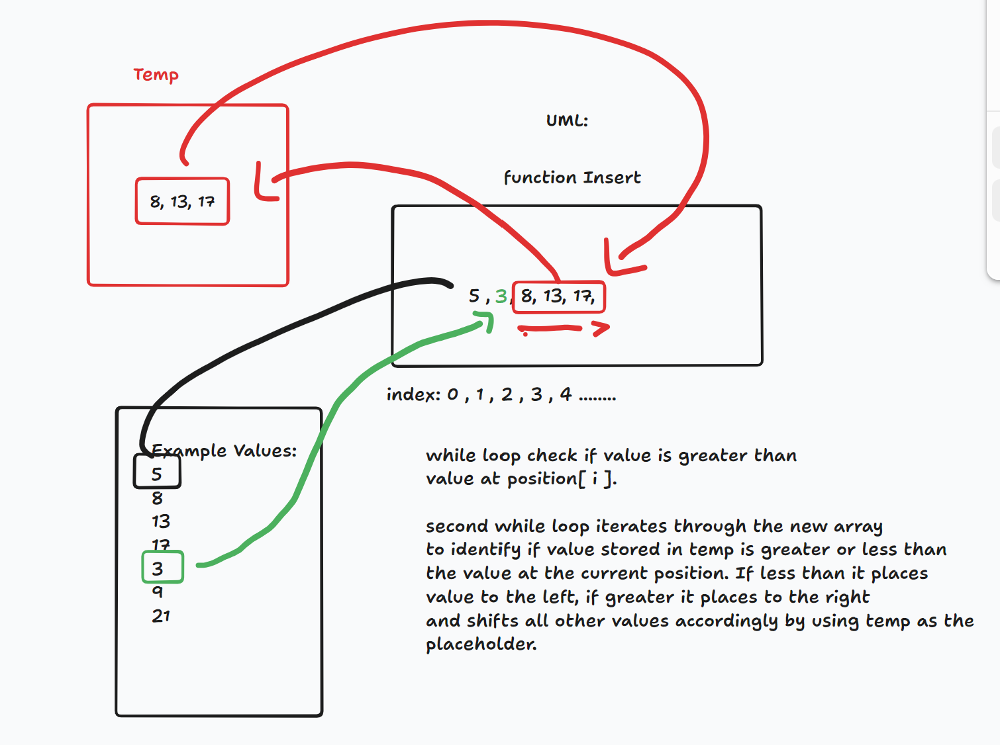

# Insertion-Sort

## Pseudocode

Insert(int[] sorted, int value)
  initialize i to 0
  WHILE value > sorted[i]
    set i to i + 1
  WHILE i < sorted.length
    set temp to sorted[i]
    set sorted[i] to value
    set value to temp
    set i to i + 1
  append value to sorted
InsertionSort(int[] input)
  LET sorted = New Empty Array
  sorted[0] = input[0]
  FOR i from 1 up to input.length
    Insert(sorted, input[i])

## Javascript

function Insert(sorted, value) {
  let i = 0;
  while (value > sorted[i]) {
    i = i + 1;
  }
  while (i < sorted.length) {
    let temp = sorted[i];
    sorted[i] = value;
    value = temp;
    i = i + 1;
  }
  sorted.push(value);
}

function InsertionSort(input) {
  let sorted = [];
  sorted[0] = input[0];
  for (let i = 1; i < input.length; i++) {
    Insert(sorted, input[i]);
  }
  return sorted;
}

## UML:

## Efficiency

Space: O(n^2)
Time: O(n^2)
