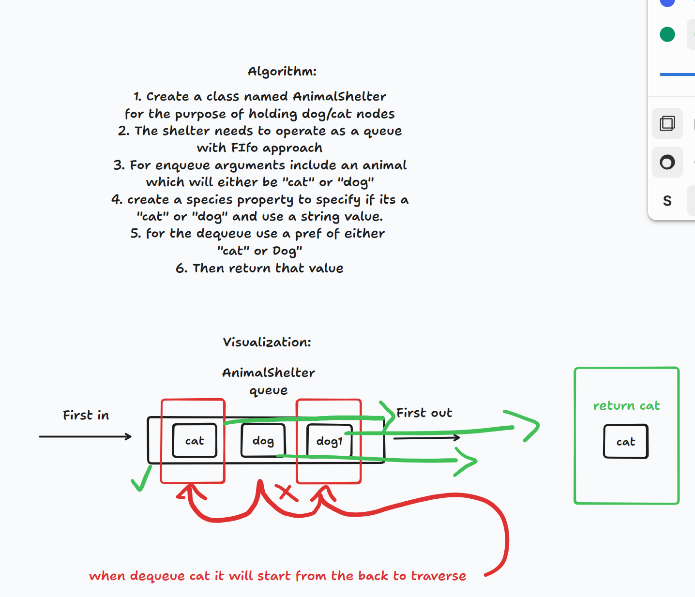

# Stack-queue-animal-shelter
create a queue and dequeue by using the FIfo approach to placing dogs in the shelter and removing them from the shelter. Have an ability to remove the oldest animal in the queue.

## Whiteboard Process

## Approach & Efficiency

## Solution
see [stack-queue-animal](/stack-queue-animal-shelter.js)-shelter.js for code
