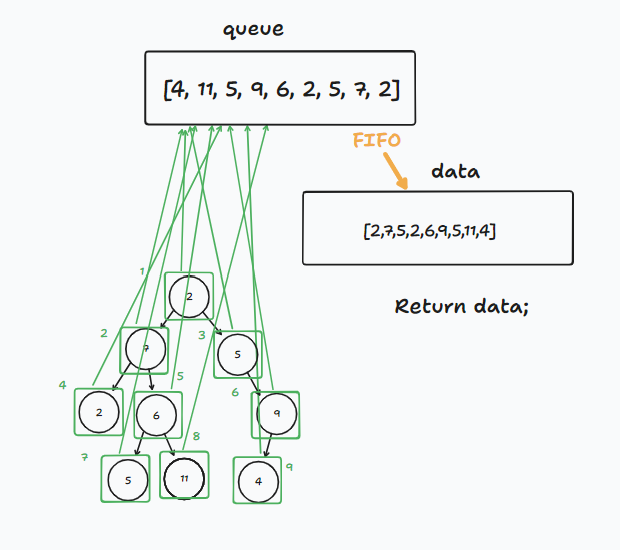

# Algoritm

1. Start by creating a queue to keep track of the nodes as we traverse the tree. Also, create an array to store the values of the nodes as we visit them.
2. Add the root node of the tree to the queue to kickstart the traversal.
3. Enter a loop that continues as long as there are nodes in the queue.
4. Inside the loop, remove the first node from the queue and add its value to the array of visited nodes.
5. If the removed node has a left child, add this child to the queue.
6. If the removed node has a right child, add this child to the queue as well.
7. Repeat steps 4 through 6 until the queue is empty.
8. Once the loop is finished, all nodes of the tree have been visited in a breadth-first manner, and their values are stored in the array.
9. Return or print the array of visited node values.

# Whiteboard

