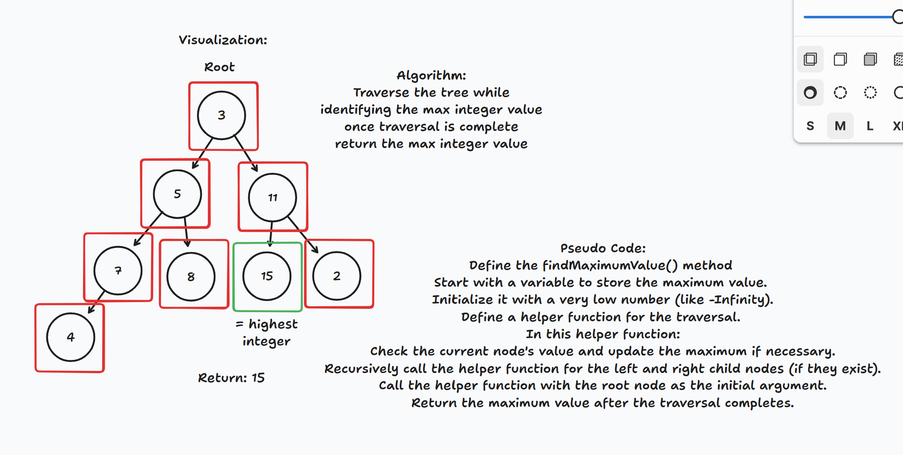

# Tree-max
** Find the greatest integer value in a tree and return that value.

## Whiteboard Process

## Approach & Efficiency
My approach was to traverse the tree while looking at the integer values to determine if they are greater than the last. If they are then we hold on to that value. When we get to the end of the full traversal of the tree we return the largest value that is held.

## Solution
See [treeMax.js](./treeMax.js)for code.
